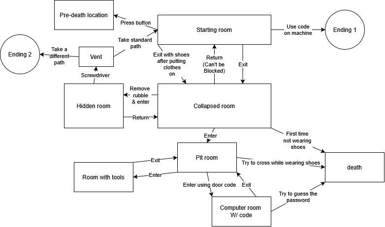

# Interactive Experience Plan

 PDF | August 2026 

## Summary

Plan for an interactive expierience where you find yourself in a strange facility. 

**Project:** Interactive Experience.

**My role:** Creator of the plan.

## The Artifact

[Picture](https://github.com/CarterzCode/Apex-Portfolio/blob/main/artifacts/InteractiveExperiencePlan/Flowchart.png)

[View the full artifact](Interactive-Experience-Project-Plan.pdf)

## Skills Demonstrated

Creative thinking
Planning

## Tools and Technologies

- Planning software

## Implementation

Using an online planning tool, I was able to construct a flowchart to help plan how an interactive experience would work. 

## What I Learned

How to effectively plan out projects.

---

[Return to All Artifacts]({{ '/artifacts.html' | relative_url }})
