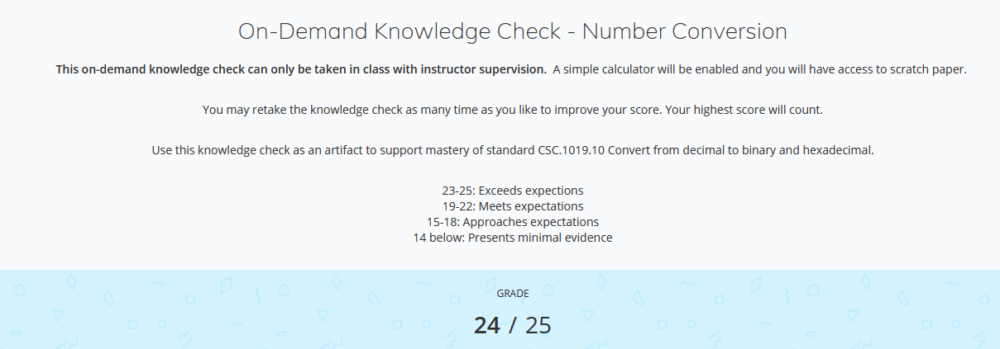

# Number Conversion

 Image | August 2026 

## Summary

Score on number conversion knowledge check.

**Project:** Text Adventure Project.

**My role:** Taker of the knowledge Check.

## The Artifact

[Picture](https://github.com/CarterzCode/Apex-Portfolio/blob/main/artifacts/NumberConversion/KnowledgeCheckScore.jpg)

[View the full artifact](KnowledgeCheckScore.png)

## Skills Demonstrated

Decimal to Binart
Binary to Hexadecimal
Decimal to Hexadecimal

## Tools and Technologies

- Number Systems
- Quick Conversions

## Implementation

Using mental math, I was able to score a 24/25 on my knowledge check for number system conversion.

## What I Learned

How to convert between different number systems quickly.

---

[Return to All Artifacts]({{ '/artifacts.html' | relative_url }})
