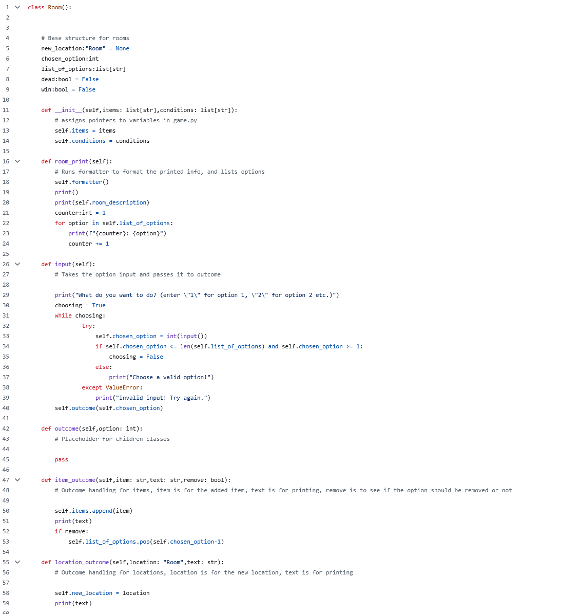

# Number Conversion

 Image | September 2026 

## Summary

This was a text adventure experience I coded and decided to use clases for, classes allowed me to easily have the rooms be dynamic while having simplistic base code.

**Project:** Text Adventure Project.

**My role:** Creator of the text adventure.

## The Artifact

[Picture](https://github.com/CarterzCode/Apex-Portfolio/blob/main/artifacts/NumberConversion/TextAdventureCode.png)

[View the full artifact](https://github.com/CarterzCode/TextAdventure)

## Skills Demonstrated

Creative Design
Concept Development

## Tools and Technologies

- Number Systems
- Quick Conversions

## Implementation

Using a class based structure, I was able to have a dynamic room based text adventure that allows the player to freely move around changing room

## What I Learned

How to implement classes and use them effectively. 

---

[Return to All Artifacts]({{ '/artifacts.html' | relative_url }})
